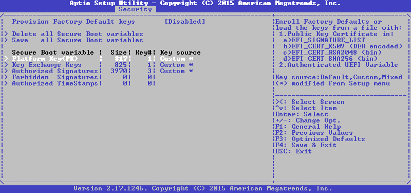

### UEFI Secure Boot Configuration Guide
### [UEFI安全启动配置教程_中文](https://github.com/Xarth-Mai/DIY-Secure_Boot/blob/main/README_zhs.md)

#### Preparation
1. **A FAT32-formatted USB drive**
2. **A Linux environment**
3. **Internet connection**

#### Step 1: Install Necessary Tools
Run the following command in the terminal to update your system and install the required tools:
```bash
pacman -Syu sbsigntools efitools
```

#### Step 2: Generate Keys
Execute the following commands to generate the necessary key files:
```bash
openssl req -new -x509 -newkey rsa:2048 -sha256 -nodes -days 3650 -subj "/CN=Platform Key" -keyout PK.key -out PK.pem
openssl req -new -x509 -newkey rsa:2048 -sha256 -nodes -days 3650 -subj "/CN=Key Exchange Key" -keyout KEK.key -out KEK.pem
openssl req -new -x509 -newkey rsa:2048 -sha256 -nodes -days 3650 -subj "/CN=Image Signing Key" -keyout ISK.key -out ISK.pem
```

#### Step 3: Convert Keys to EFI Signature List Format
Convert the generated keys to EFI signature list format using the following commands:
```bash
cert-to-efi-sig-list -g "$(uuidgen)" PK.pem PK.esl
cert-to-efi-sig-list -g "$(uuidgen)" KEK.pem KEK.esl
cert-to-efi-sig-list -g "$(uuidgen)" ISK.pem ISK.esl
```

#### Step 4: Add Microsoft Keys (Optional, for Windows Compatibility)
1. Convert Microsoft's certificates to PEM format:
```bash
openssl x509 -in MicWinProPCA2011_2011-10-19.crt -inform DER -out MsWin.pem -outform PEM
openssl x509 -in MicCorUEFCA2011_2011-06-27.crt -inform DER -out UEFI.pem -outform PEM
```
2. Convert these certificates to EFI signature list format and merge them:
```bash
cert-to-efi-sig-list -g "$(uuidgen)" MsWin.pem MsWin.esl
cert-to-efi-sig-list -g "$(uuidgen)" MsWin.pem MsWin.esl
cat MsWin.esl UEFI.esl >> db.esl
```

#### Step 5: Sign the Keys
Execute the following commands to create signed key files:
```bash
cat ISK.esl >> db.esl
sign-efi-sig-list -k PK.key -c PK.pem PK PK.esl PK.auth
sign-efi-sig-list -k PK.key -c PK.pem KEK KEK.esl KEK.auth
sign-efi-sig-list -k KEK.key -c KEK.pem db db.esl db.auth
```

#### Step 6: Sign All EFI Files You Want to Boot
Use the following command to sign the EFI files:
```bash
sbsign --key ISK.key --cert ISK.pem --output bootx64.efi
```

#### Step 7: Replace Signed EFI Files on Your Boot Disk
After signing the EFI files, replace them on your boot disk.

#### Step 8: Configure BIOS
1. Copy the `PK.esl`, `DB.esl`, and `KEK.esl` files to a USB drive or any location that your BIOS can recognize.
2. Restart your computer and enter the BIOS. Before configuring Secure Boot, disable CSM (Compatibility Support Module).
3. Go to the Security tab and locate the Secure Boot settings. Change the mode to "Custom."

4. Enter the Key Management menu. You should see the following options:

5. Select the variable `PK` (Platform Key). You will be prompted to choose between installing a new key and adding to an existing one. Choose the first option:

6. Now, you can either set the default values or load your own values from a file. Choose the latter:

7. Select the corresponding `.esl` file.
   - In our case, it is an `Authenticated Variable`:

8. Confirm the file update. If everything went smoothly, you will receive a simple confirmation message:

9. Repeat the same process for `KEK.esl` and `db.esl`, with `db.esl` corresponding to the `Authorized Signatures` option.


### Finally: Save the changes in BIOS and reboot your system.
