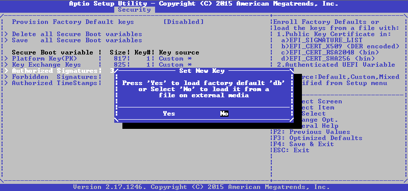

### UEFI安全启动配置教程（适用于Opencore、Linux及其他系统）

本文改编并简化自：[Habr/CodeRush](https://habr.com/en/articles/273497)

[English Version](https://github.com/Xarth-Mai/DIY-Secure_Boot/blob/main/README.md)

---

#### 第零步：Opencore设置（仅适用于Opencore用户）
根据[官方文档](https://dortania.github.io/OpenCore-Post-Install/universal/security/applesecureboot.html)，正确配置 `Misc -> Security -> DmgLoading` 和 `Misc -> Security -> SecureBootModel`。

#### 第一步：安装必要工具
在终端中运行以下命令以更新系统并安装所需工具：
```bash
pacman -Syu sbsigntools efitools
```

#### 第二步：生成密钥
执行以下命令生成所需的密钥文件：
```bash
openssl req -new -x509 -newkey rsa:2048 -sha256 -nodes -days 3650 -subj "/CN=Platform Key" -keyout PK.key -out PK.pem
openssl req -new -x509 -newkey rsa:2048 -sha256 -nodes -days 3650 -subj "/CN=Key Exchange Key" -keyout KEK.key -out KEK.pem
openssl req -new -x509 -newkey rsa:2048 -sha256 -nodes -days 3650 -subj "/CN=Image Signing Key" -keyout ISK.key -out ISK.pem
```

#### 第三步：转换密钥格式
使用以下命令将生成的密钥转换为EFI签名列表格式：
```bash
cert-to-efi-sig-list -g "$(uuidgen)" PK.pem PK.esl
cert-to-efi-sig-list -g "$(uuidgen)" KEK.pem KEK.esl
cert-to-efi-sig-list -g "$(uuidgen)" ISK.pem ISK.esl
```

#### 第四步：添加微软密钥（可选，用于启动Windows）
1. 将微软证书转换为PEM格式：
```bash
openssl x509 -in MicWinProPCA2011_2011-10-19.crt -inform DER -out MsWin.pem -outform PEM
openssl x509 -in MicCorUEFCA2011_2011-06-27.crt -inform DER -out UEFI.pem -outform PEM
```
2. 将这些证书转换为EFI签名列表格式并合并：
```bash
cert-to-efi-sig-list -g "$(uuidgen)" MsWin.pem MsWin.esl
cert-to-efi-sig-list -g "$(uuidgen)" UEFI.pem UEFI.esl
cat MsWin.esl UEFI.esl >> db.esl
```

#### 第五步：签名密钥
执行以下命令生成签名的密钥文件：
```bash
cat ISK.esl >> db.esl
sign-efi-sig-list -k PK.key -c PK.pem PK PK.esl PK.auth
sign-efi-sig-list -k PK.key -c PK.pem KEK KEK.esl KEK.auth
sign-efi-sig-list -k KEK.key -c KEK.pem db db.esl db.auth
```

#### 第六步：签名所有要启动的EFI文件
使用以下命令对EFI文件进行签名：
```bash
sbsign --key ISK.key --cert ISK.pem --output bootx64.efi
```

#### 第七步：将签名后的EFI文件替换到启动磁盘上
将签名后的EFI文件替换到你的启动磁盘上。

#### 第八步：配置BIOS
1. 将 `PK.esl`、`DB.esl` 和 `KEK.esl` 文件复制到U盘或任意BIOS可识别的位置。
2. 重启计算机并进入BIOS。在配置Secure Boot之前，请先禁用CSM（兼容性支持模块）。
3. 进入安全选项卡，找到Secure Boot设置，将模式更改为“自定义”。

4. 进入密钥管理菜单，你将看到以下选项：

5. 选择变量 `PK`（平台密钥）。你将被提示选择安装新密钥还是添加到现有密钥中。选择第一个选项：

6. 选择设置默认值或从文件加载你的值。选择后者：

7. 选择对应的 `.esl` 文件。
   - 在我们的例子中，是 `经过身份验证的变量`：

8. 确认文件更新。如果一切顺利，你将收到一个简单的确认消息：

9. 对 `KEK.esl` 和 `db.esl` 重复相同的操作，其中 `db.esl` 对应于 `授权签名` 选项。


### 最后：保存BIOS修改并重启系统
- 如果一切设置正确，安全启动现在应该可以正常运行。

### 额外步骤（仅适用于Opencore用户）
如果你在启用了安全启动之前安装了MacOS，那么现在将无法启动。你需要启动到恢复模式，然后执行：
```bash
bless --folder "/Volumes/YourMacVolume/System/Library/CoreServices" --bootefi --personalize
```
